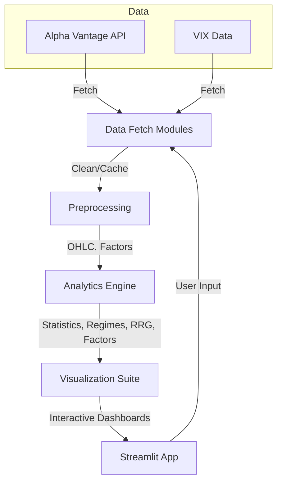

# 📈 Sector-Rotation Dashboard


---

## 📝 Executive Summary

**Sector-Rotation Pro** is a professional-grade, modular Streamlit dashboard for sector rotation, regime detection, forecasting, and multifactor technical/statistical analysis. Built for equity investment research, it empowers portfolio managers, analysts, and students to:

- Quantitatively analyze sector leadership, rotation cycles, and market regimes
- Backtest and visualize tactical allocation strategies
- Integrate robust forecasting and risk management workflows
- Communicate results with high-impact, interactive visuals

Originally developed by **Jake Ransom** for the Rabsamen Trust at the University of Arkansas, it is now a comprehensive, extensible dashboard for quick sector rotation research.

---

## 🏗️ Workflow Architecture



---

## 🌟 Key Features

- 📈 **Automated Data Acquisition:**
  - Robust integration with Alpha Vantage for historical OHLC and VIX data
  - Data cleaning, adjustment, and caching for reproducible analysis
- 🔬 **Analytics:**
  - Rolling Hurst exponent for regime detection
  - Relative Rotation Graphs (RRG) for sector momentum & rotation
  - Technical indicators: RSI, momentum, rolling beta, Sharpe, drawdown, skew, kurtosis
  - Correlation, lead-lag, and Granger causality for inter-sector relationships
  - PCA & spectral clustering for sector grouping and anomaly detection
- 🔮 **Forecasting:**
  - Prophet (via Darts) for trend/seasonality decomposition and probabilistic forecasting
- 📊 **Interactive Visualization Suite:**
  - Modular Streamlit dashboards for price, volatility, RRG, technicals, ratios, PCA, and forecasting
  - Advanced Plotly visuals: candlesticks, heatmaps, network graphs, animated RRGs
- 🛡️ **Error Handling & Transparency:**
  - Defensive code, clear logging, and transparent error messages
- 🧩 **Extensible & Educational:**
  - Modular structure for easy extension; detailed docstrings and best practices throughout

---

## 💼 Investment Applications

- **Regime-Aware Allocation:** Use Hurst exponent and VIX regimes to dynamically shift between momentum and defensive sectors.
- **Sector Rotation Timing:** Leverage RRGs and momentum analytics to identify sector leadership and rotation cycles for tactical allocation.
- **Risk Management:** Employ rolling beta, Sharpe, drawdown, and correlation analytics for portfolio construction and risk targeting.
- **Scenario Analysis:** Use Prophet-based forecasting and regime overlays to stress test sector exposures and inform allocation pivots.
- **Diversification & Hedging:** Apply PCA, clustering, and Granger causality to reveal hidden sector dependencies and optimize diversification.
- **Communication:** Interactive dashboards and visuals support investment committee presentations and stakeholder reporting.

---

## 🧩 Module-by-Module Breakdown

## 🗂️ Directory Structure

```plaintext
sector_rotation_pro/
├── app.py                # 🚦 Streamlit dashboard & orchestrator
│
├── data/                 # 📦 Data acquisition & preprocessing
│   ├── fetch.py          # Alpha Vantage API wrapper
│   ├── fetch_fixed.py    # Alternate fetch logic
│   └── fetch_ohlc.py     # OHLCV data handler
│
├── analytics/            # 🔬 Quantitative/statistical logic
│   ├── forecasting.py    # Prophet-based forecasting
│   ├── hurst.py          # Hurst exponent analysis
│   ├── regimes.py        # Regime detection
│   ├── rrg.py            # Relative Rotation Graphs
│   ├── stats_tests.py    # Correlation, causality, network
│   └── ta_factors.py     # Technical factors
│
├── visuals/              # 📊 Interactive Plotly/Seaborn figures
│   ├── forecast_fig.py   # Forecast visuals
│   ├── heatmaps.py       # Heatmaps & dashboards
│   ├── network.py        # Correlation networks
│   ├── pca_cluster.py    # PCA & clustering
│   ├── price_volatility.py # Price/volatility charts
│   ├── ratio_plots.py    # Ratio analysis
│   └── rrg_fig.py        # RRG & momentum visuals
│
├── requirements.txt      # 📦 Python dependencies
├── .env.example          # 🔑 API key template
└── README.md             # 📚 This documentation
```

---

## 🧠 Technical & Analytical Methods

- **Rolling Hurst Exponent:** Regime detection (trend vs. mean-reversion)
- **Relative Rotation Graphs (RRG):** Sector momentum, leadership, and rotation
- **Technical Factors:** RSI, multi-horizon momentum, drawdowns, Rolling: beta, Sharpe, skew, kurtosis
- **Statistical Analysis:** Correlation, lead-lag, Granger causality, network graphs
- **PCA & Spectral Clustering:** Dimensionality reduction, sector grouping, anomaly detection
- **Forecasting:** Prophet (via Darts) for trend/seasonality and scenario analysis
- **Interactive Visualization:** Streamlit dashboards, Plotly/Seaborn charts, animated RRGs, regime overlays
- **Defensive Programming:** Robust error handling, transparent logging, and reproducibility

---

## ⚙️ Installation & Usage

```bash
pip install -r requirements.txt
```

```bash
streamlit run app.py
```

- Requires Python 3.8+
- Set your Alpha Vantage API key in `.env` as `ALPHA_VANTAGE_API_KEY=your_key_here`

---

## 👤 Author, License & Disclaimer

> **Author:** Jake Ransom  
> **License:** Educational Use Only  
> **Disclaimer:** *Not for commercial or investment use. For demonstration and educational purposes only.*

---
